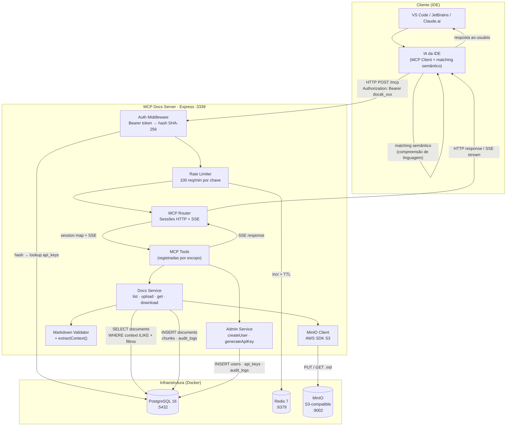
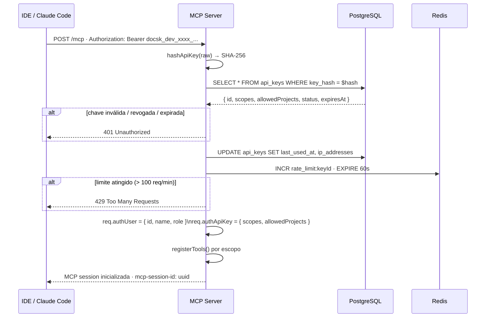
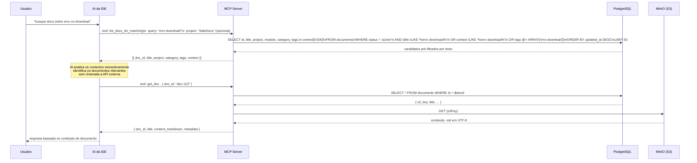
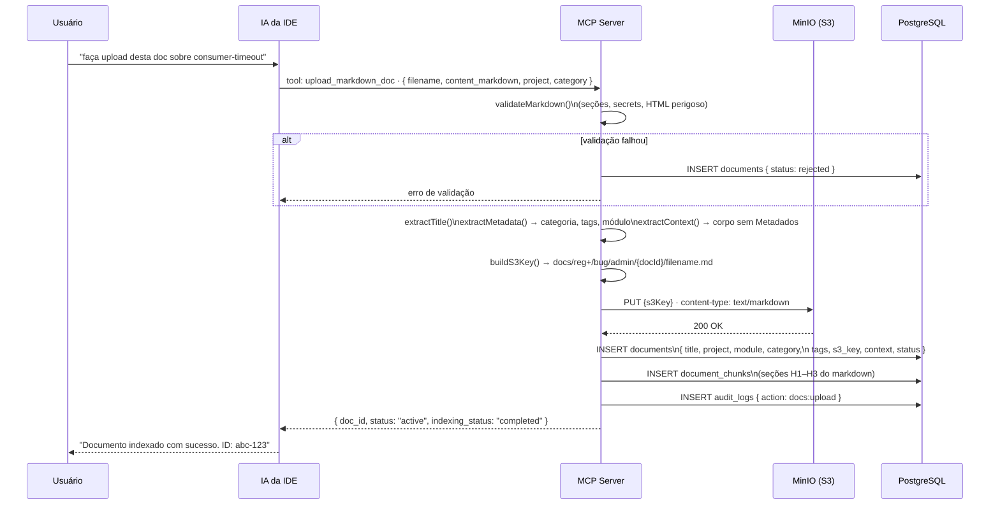
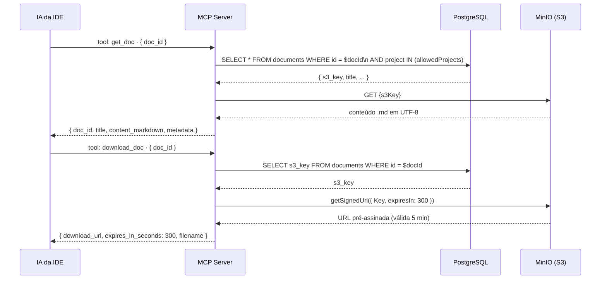
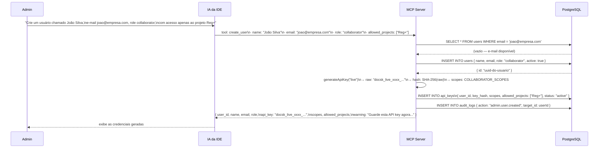

# Arquitetura e Fluxo de Comunicação

---

## 1. Visão geral da arquitetura



---

## 2. Fluxo de autenticação



---

## 3. Fluxo de busca semântica (list_docs_for_matching)

A busca semântica é realizada pela própria IA da IDE, sem APIs externas. O servidor fornece os contextos extraídos; a IA decide a relevância usando compreensão de linguagem natural.



### Estratégia de escalabilidade

| Tamanho da base | Uso recomendado |
|---|---|
| Até ~200 docs | `list_docs_for_matching()` sem query — IA lê todos os contextos diretamente |
| 200–1000 docs | `list_docs_for_matching(query: "termos do problema")` — pré-filtro textual reduz o conjunto |
| 1000+ docs | Combinar `project` + `category` + `query` — manter resultado abaixo de ~50 docs |

O campo `context` retornado é truncado a **500 caracteres** — suficiente para a IA avaliar relevância sem sobrecarregar o contexto da conversa.

---

## 4. Fluxo de upload e indexação (upload_markdown_doc)



---

## 5. Fluxo de leitura completa (get_doc + download_doc)



---

## 6. Estrutura de dados (PostgreSQL)

```
documents
├── id            UUID PK
├── title         TEXT
├── filename      TEXT
├── project       TEXT           (ex: "Reg+", "SafeDocs")
├── module        TEXT?          (ex: "Admin", "Mensageria")
├── category      TEXT           (Bug | Procedimento | Decisão técnica | ...)
├── status        TEXT           (active | review_required | rejected)
├── tags          TEXT[]
├── s3_key        TEXT           (caminho no MinIO)
├── context       TEXT?          (corpo semântico extraído do markdown — base do matching)
├── created_by    UUID → users
└── updated_at    TIMESTAMP

document_chunks
├── id            UUID PK
├── document_id   UUID → documents (CASCADE DELETE)
├── section_title TEXT?
├── chunk_index   INT
└── content       TEXT

api_keys
├── id              UUID PK
├── user_id         UUID → users
├── key_hash        TEXT (SHA-256)
├── scopes          TEXT[]
├── allowed_projects TEXT[]
├── status          TEXT (active | revoked | expired)
└── last_used_at    TIMESTAMP

audit_logs
├── action     TEXT  (mcp.session.created | docs:search | docs:upload | admin.user.created | ...)
├── result     TEXT  (success | error)
└── metadata   JSONB
```

---

## 7. Campo context — base do matching semântico

O campo `context` é extraído no upload via `extractContext()`. Ele remove a seção `## Metadados` e blocos de código, preservando o texto das seções de conteúdo:

```
## 1. Contexto
O módulo Admin do projeto Reg+ permite que colaboradores façam
download de documentos armazenados no storage privado...

## 4. Causa raiz
A URL pré-assinada estava sendo gerada com expiração de 30 segundos...

## 5. Solução aplicada
Aumentado o tempo de expiração de 30 para 300 segundos...
[...]
```

Quanto mais detalhadas as seções do documento, melhor o matching semântico — a IA recebe os primeiros 500 caracteres deste campo para avaliar relevância antes de buscar o conteúdo completo.

---

## 8. Fluxo de criação de usuário (create_user)

A tool `create_user` é exclusiva do escopo `admin:keys`. Ela cria o usuário, gera a API key e registra no audit log em uma única chamada. A chave raw só existe neste retorno — o servidor armazena apenas o hash SHA-256.



### Escopos concedidos por role

| Role | Escopos da API key gerada |
|---|---|
| `admin` | `docs:search`, `docs:read`, `docs:download`, `docs:upload`, `docs:update`, `docs:delete`, `admin:keys`, `admin:audit` |
| `collaborator` | `docs:search`, `docs:read`, `docs:download`, `docs:upload` |
| `readonly` | `docs:search`, `docs:read`, `docs:download` |

---

## 9. Banco de dados e alternativas de infraestrutura

O projeto usa PostgreSQL como única dependência de banco de dados. O matching semântico é realizado pela própria IA da IDE, sem extensões vetoriais ou APIs externas — o PostgreSQL é usado apenas para persistência de metadados e busca textual via `ILIKE`.

Para rodar em ambiente gerenciado sem Docker local, qualquer serviço PostgreSQL-compatible funciona sem mudança de código:

| Opção | Descrição |
|---|---|
| **Neon** | PostgreSQL serverless, free tier generoso |
| **Supabase** | PostgreSQL gerenciado com painel web |
| **RDS PostgreSQL** | Gerenciado na AWS |
| **Aurora Serverless v2** | PostgreSQL-compatible, escala para zero |

> Veja [postgres-vs-dynamodb.md](postgres-vs-dynamodb.md) para a análise de viabilidade de migração para DynamoDB.
