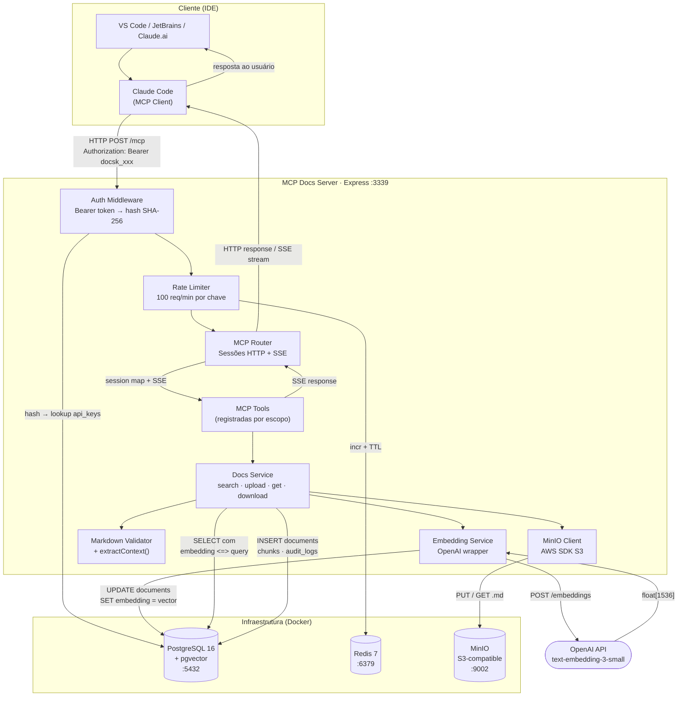
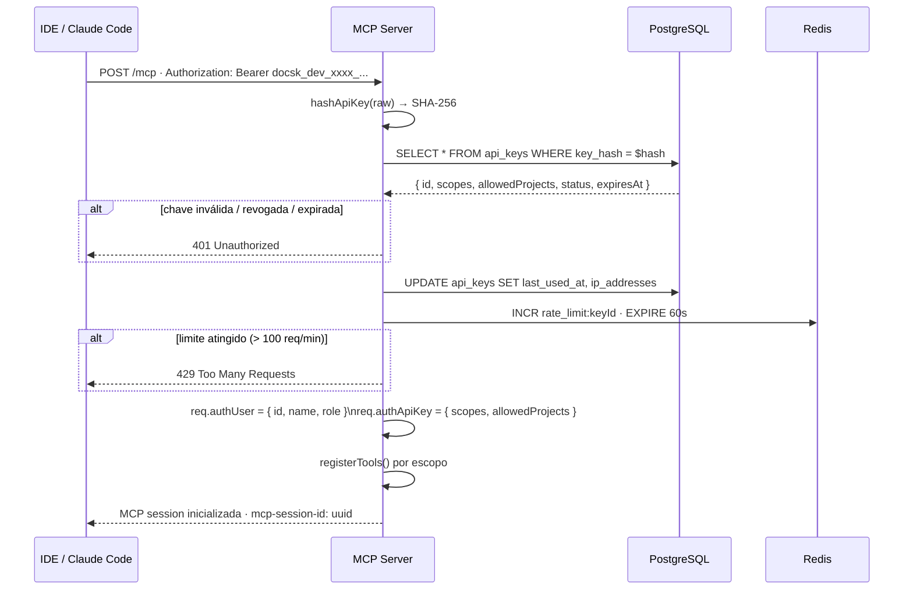
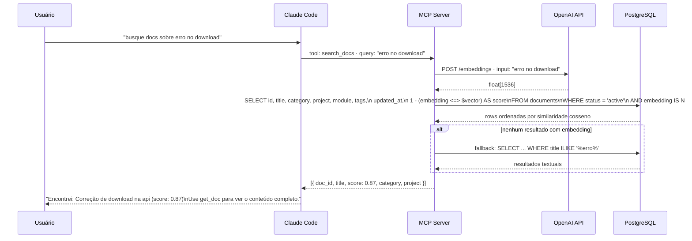
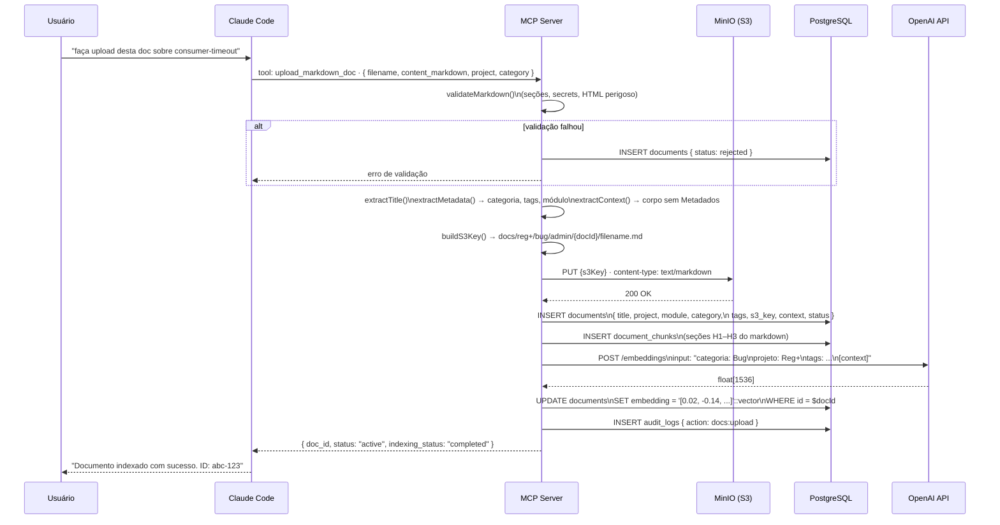

# Arquitetura e Fluxo de Comunicação

---

## 1. Visão geral da arquitetura



---

## 2. Fluxo de autenticação



---

## 3. Fluxo de busca semântica (search_docs)



---

## 4. Fluxo de upload e indexação (upload_markdown_doc)



---

## 5. Fluxo de leitura completa (get_doc + download_doc)


---

## 6. Estrutura de dados (PostgreSQL)

```
documents
├── id            UUID PK
├── title         TEXT
├── filename      TEXT
├── project       TEXT           (ex: "Reg+", "SafeDocs")
├── module        TEXT?          (ex: "Admin", "Mensageria")
├── category      TEXT           (Bug | Procedimento | Decisão técnica | ...)
├── status        TEXT           (active | review_required | rejected)
├── tags          TEXT[]
├── s3_key        TEXT           (caminho no MinIO)
├── context       TEXT?          (corpo semântico extraído do markdown)
├── embedding     vector(1536)?  (pgvector — gerado via OpenAI)
├── created_by    UUID → users
└── updated_at    TIMESTAMP

document_chunks
├── id            UUID PK
├── document_id   UUID → documents (CASCADE DELETE)
├── section_title TEXT?
├── chunk_index   INT
└── content       TEXT

api_keys
├── id              UUID PK
├── user_id         UUID → users
├── key_hash        TEXT (SHA-256)
├── scopes          TEXT[]
├── allowed_projects TEXT[]
├── status          TEXT (active | revoked | expired)
└── last_used_at    TIMESTAMP

audit_logs
├── action     TEXT  (mcp.session.created | docs:search | docs:upload | ...)
├── result     TEXT  (success | error)
└── metadata   JSONB
```

---

## 7. Estratégia de embeddings

O texto enviado ao modelo `text-embedding-3-small` combina metadados estruturados com o contexto semântico:

```
categoria: Bug
projeto: Reg+
módulo: Admin
tags: download, storage, url-assinada, s3
título: Correção de download no módulo Admin

## 1. Contexto
O módulo Admin do projeto Reg+ permite que colaboradores façam
download de documentos armazenados no storage privado...

## 4. Causa raiz
A URL pré-assinada estava sendo gerada com expiração de 30 segundos...

## 5. Solução aplicada
Aumentado o tempo de expiração de 30 para 300 segundos...
[...]
```

Isso garante que:
- Metadados estruturados influenciam a similaridade (filtros semânticos)
- O corpo do documento carrega o contexto técnico real
- Seção `## Metadados` é excluída do contexto (já está em colunas separadas)
- Blocos de código são excluídos (não agregam valor semântico)
